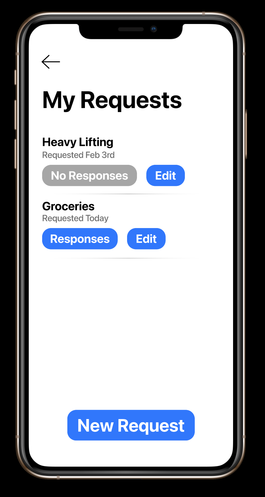
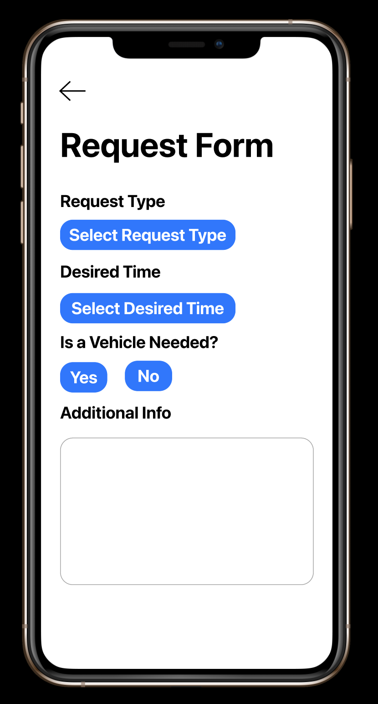

# covid-volunteer
A figma project outlining an application that provides covid information, reccomendations/guides, and a service that connects seniors in need to volunteers.
## Links:
- [Figma project](https://www.figma.com/file/STev0CNuhCSymN0KFcRoYa/Assignment2)
- [Overview video](https://youtu.be/O0jDz5iwvxo)
## Screenshots:

