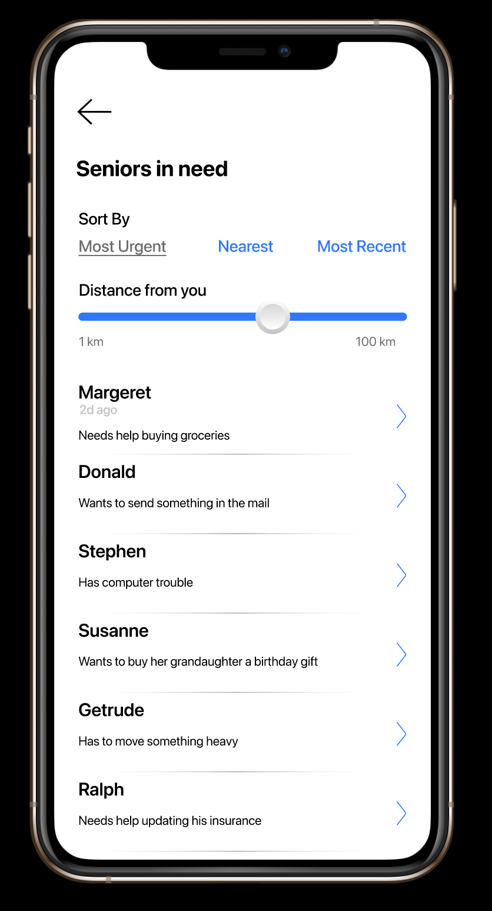

# covid-volunteer
A figma project outlining an application that provides covid information, reccomendations/guides, and a service that connects seniors in need to volunteers.
## Links:
- [Figma project](https://www.figma.com/file/STev0CNuhCSymN0KFcRoYa/Assignment2)
- [Overview video](https://youtu.be/O0jDz5iwvxo)
## Functionalities:
- Conncting seniors with volunteers
- Chatting with seniors
- Unique interfaces for elderly and younger people
- Filterable covid statistics
- Related local news presented along side stats
## Screenshots:

